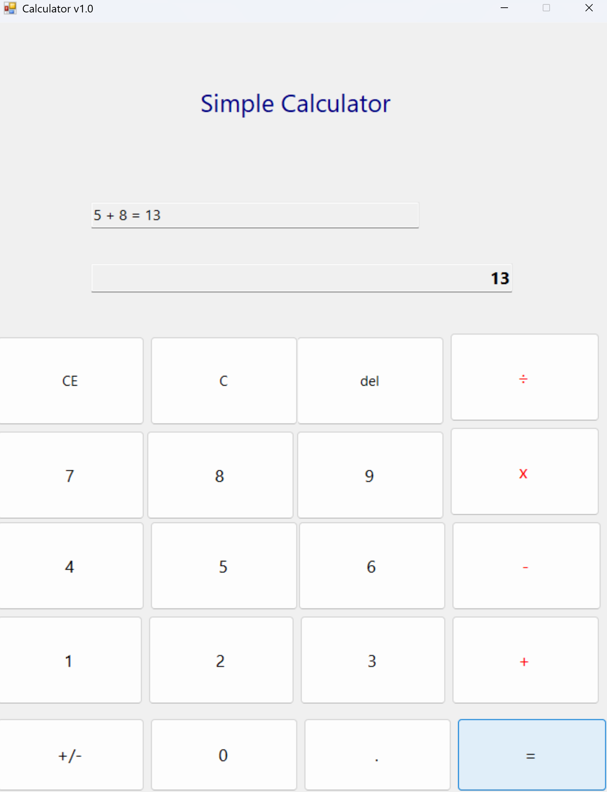
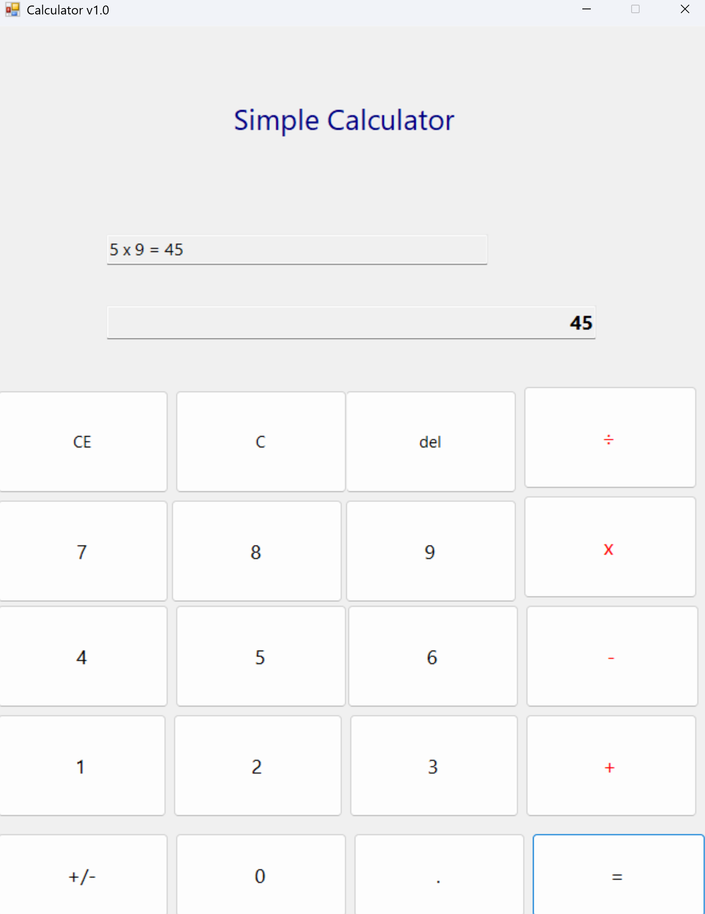
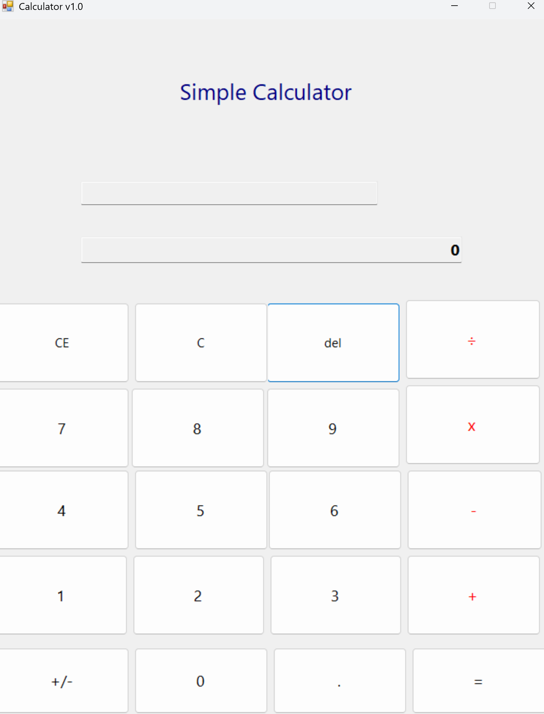
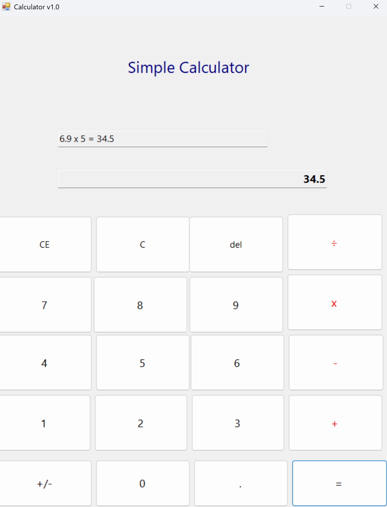

# (C# 코딩) 심플 사칙연산기

## 개요
- C# 프로그래밍 학습
- 1줄 소개: 사칙연산을 수행하는 계산기 프로그램
- 사용한 플랫폼:
  - C#, .NET Windows Forms, Visual Studio, GitHub
- 사용한 컨트롤:
  - Label, TextBox, Button
- 사용한 기술과 구현한 기능:
  - Visual Studio를 이용하여 계산기 UI 디자인
  - int.Parse / double.TryParse를 이용한 문자열-숫자 변환 처리
  - ToString 메서드를 이용한 숫자-문자열 변환 처리
  - switch문을 활용한 연산자별 분기 처리
  - 이벤트 핸들러를 활용한 버튼 클릭 및 키보드 입력 처리
  - KeyDown 이벤트를 이용한 키보드 단축키 지원
  - 공통 메서드(BtnOperator_Click)로 4가지 연산자 버튼 통합 처리

## 실행 화면 (과제1)
- 과제1 코드의 실행 스크린샷

- 과제 내용
  - Label(타이틀), TextBox 2개(수식표시, 결과표시), Button(숫자, 연산자)을 배치합니다.
  - 숫자 Button 클릭 시 txtDisplay에 숫자가 표시됩니다.
  - 더하기(+) 버튼과 등호(=) 버튼으로 덧셈 계산을 수행합니다.
- 구현 내용과 기능 설명
  - 숫자 버튼(0~9)을 클릭하면 하단 텍스트박스에 숫자가 표시된다.
  - 더하기 버튼을 누르면 첫 번째 피연산자가 저장되고, 상단 수식 표시줄에 "5 + " 형태로 표시된다.
  - 등호 버튼을 누르면 덧셈 결과가 계산되어 "5 + 2 = 7" 형태로 전체 수식이 표시된다.

## 실행 화면 (과제2)
- 과제2 코드의 실행 스크린샷

- 과제 내용
  - 뺄셈(-), 곱셈(x), 나눗셈(÷) 버튼을 추가합니다.
  - 각 버튼 클릭 시 연산자만 변경하여 동일 로직을 적용합니다.
- 구현 내용과 기능 설명
  - BtnOperator_Click 공통 이벤트 핸들러로 4가지 연산자 버튼을 통합 처리한다.
  - switch문을 사용하여 연산자에 따라 다른 계산을 수행한다.
  - 0으로 나누기 시도 시 오류 메시지를 표시하여 예외를 방지한다.
  - 수식 표시줄에 "5 x 2 = 10" 형태로 연산 과정과 결과가 함께 표시된다.

## 실행 화면 (과제3)
- 과제3 코드의 실행 스크린샷

- 과제 내용
  - C, CE, Del 버튼의 기능을 구현합니다.
  - C 버튼은 전체 초기화, CE 버튼은 현재 피연산자 삭제, Del 버튼은 마지막 글자 삭제 기능입니다.
- 구현 내용과 기능 설명
  - C 버튼을 누르면 모든 변수와 화면이 초기 상태로 되돌아간다.
  - CE 버튼을 누르면 현재 입력 중인 피연산자만 0으로 초기화된다. (연산자와 첫 번째 피연산자는 유지)
  - Del 버튼을 누르면 마지막에 입력된 숫자 한 글자가 삭제된다. (100 → 10)
  - 한 글자만 남은 상태에서 Del을 누르면 0으로 초기화된다.

## 실행 화면 (과제4)
- 과제4 코드의 실행 스크린샷

- 과제 내용
  - Windows 계산기를 참고하여 사용자 편의기능과 특수기능을 추가합니다.
- 구현 내용과 기능 설명
  - +/- 부호 전환 버튼 구현: 양수를 음수로, 음수를 양수로 전환할 수 있다.
  - 소수점(.) 버튼 구현: 소수점 중복 입력을 방지하고, double 타입으로 소수점 연산을 지원한다.
  - 키보드 입력 지원: 숫자키(메인/넘패드), 연산자키(+, -, *, /), Enter(=), Backspace(Del), Escape(C), Delete(CE) 키를 매핑했다.
  - 연속 계산 기능: 계산 결과를 다음 연산의 첫 번째 피연산자로 자동 저장하여 연속 연산이 가능하다.
  - 계산 완료 후 새 숫자 입력 시 수식 표시줄이 자동 초기화된다.
  - FormatNumber 메서드로 정수는 소수점 없이, 소수는 소수점을 포함하여 깔끔하게 표시한다.

## 배운 내용
- TextBox의 Text 속성을 활용하여 문자열 데이터를 처리하는 방법을 익혔다.
- int.Parse와 double.TryParse를 이용한 문자열-숫자 변환 방법을 배웠다.
- 이벤트 핸들러를 공통으로 사용하여 코드 중복을 줄이는 방법을 배웠다.
- KeyDown 이벤트와 KeyPreview 속성을 활용하여 키보드 입력을 처리하는 방법을 익혔다.
- switch문을 활용한 분기 처리로 연산자별 다른 계산을 수행하는 구조를 이해했다.
